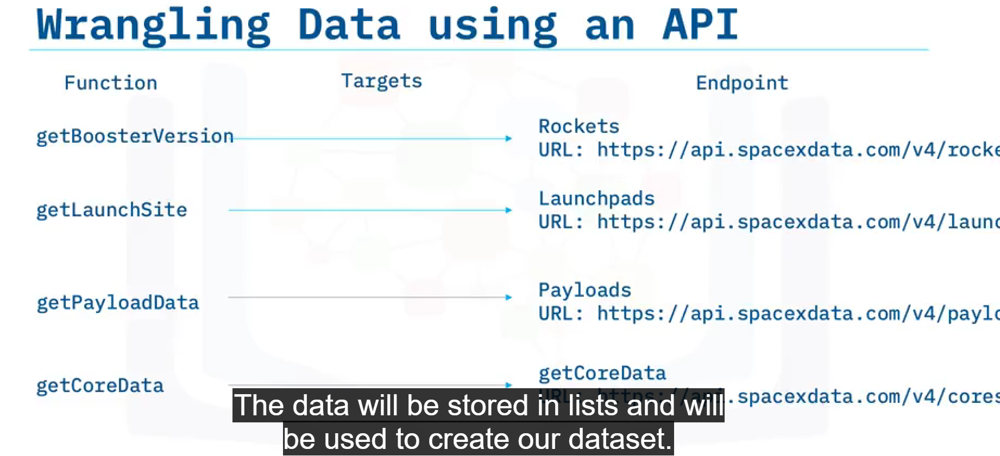

## Data Wrangling

- REST API: api.spacexdata.com/v4/launches/past
- data = pd.json_normalize(response.json()).
- To convert this JSON to a dataframe, we can use the json_normalize function. This function will allow us to “normalize” the structured json data into a flat table. This is what your JSON will look like in a table form

